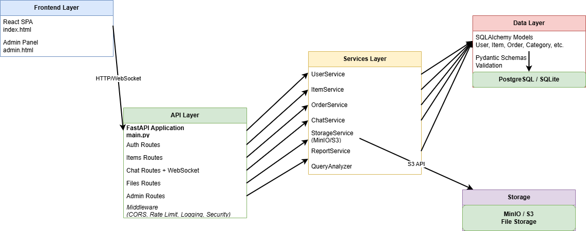

# PC Place - Маркетплейс комплектующих для ПК

Полнофункциональный маркетплейс для продажи компьютерных комплектующих на FastAPI с React фронтендом.


[](https://codecov.io/gh/aswqdddwqsxqwedd-png/PC-market)
[](https://github.com/aswqdddwqsxqwedd-png/PC-market/actions)

## Основные возможности

- **Аутентификация**: JWT с ролями (Пользователь, Продавец, Админ, Поддержка)
- **Товары**: 10 категорий комплектующих с фильтрацией и поиском
- **Корзина и заказы**: Полный цикл покупки
- **Админ-панель**: Управление пользователями, товарами, заказами
- **Чат**: Поддержка клиентов и общение по заказам
- **Файлы**: Загрузка изображений через MinIO/S3
- **Отчеты**: Аналитика для администраторов
- **Адаптивный дизайн**: Корректное отображение на мобильных устройствах и планшетах

## Архитектура



**Слои системы:**
- **Frontend**: React SPA (index.html, admin.html, seller.html)
- **API**: FastAPI с роутами и middleware
- **Services**: Бизнес-логика (UserService, ItemService, ChatService, StorageService, ReportService)
- **Data**: SQLAlchemy Models, Pydantic Schemas, PostgreSQL/SQLite
- **Storage**: MinIO/S3 для файлов
- **WebSocket**: Real-time чат и уведомления

## Быстрый старт

### Docker (рекомендуется)

```bash
docker-compose up -d
docker-compose exec app alembic upgrade head
```

Приложение будет доступно на http://localhost:8000

### Локальная установка

```bash
# Установка зависимостей
pip install -r requirements.txt

# Применение миграций
alembic upgrade head

# Запуск сервера
uvicorn app.main:app --reload
```

## Тестовые аккаунты

| Роль | Email | Пароль |
|------|-------|--------|
| Админ | admin@pcplace.com | admin123 |
| Продавец | seller@pcplace.com | seller123 |
| Поддержка | support@pcplace.com | support123 |
| Пользователь | user@pcplace.com | user123 |

## Структура проекта

```
pc-place/
├── app/
│   ├── api/          # API endpoints
│   ├── core/         # Конфигурация, безопасность
│   ├── db/           # База данных
│   ├── models/       # SQLAlchemy модели
│   ├── schemas/      # Pydantic схемы
│   ├── services/     # Бизнес-логика
│   ├── middleware/   # Middleware (logging, rate limit, security)
│   ├── utils/        # Утилиты (query analyzer)
│   └── main.py       # Точка входа
├── static/
│   ├── index.html    # Основное приложение
│   ├── admin.html    # Админ-панель
│   └── seller.html   # Панель продавца
├── alembic/          # Миграции БД
├── docs/             # Документация
├── tests/            # Тесты
└── docker-compose.yml
```

## API Endpoints

### Основные
- `POST /api/v1/auth/register` - Регистрация
- `POST /api/v1/auth/login` - Вход
- `GET /api/v1/items` - Список товаров
- `GET /api/v1/categories` - Категории
- `POST /api/v1/orders` - Создать заказ

### Админ
- `GET /api/v1/admin/dashboard` - Статистика
- `GET /api/v1/admin/users` - Пользователи
- `POST /api/v1/admin/users` - Создать пользователя
- `POST /api/v1/admin/items` - Создать товар
- `GET /api/v1/admin/reports/*` - Отчеты

### Файлы
- `POST /api/v1/files/upload/image` - Загрузить изображение
- `POST /api/v1/files/presigned-url` - Pre-signed URL

### Чат
- `POST /api/v1/chat/messages` - Отправить сообщение
- `GET /api/v1/chat/conversations` - Список бесед
- `WebSocket /api/v1/chat/ws/{user_id}` - Real-time чат

Полная документация API: http://localhost:8000/docs

## Docker

### Сервисы
- **app**: FastAPI приложение (порт 8000)
- **db**: PostgreSQL (порт 5432)
- **minio**: MinIO для файлов (порты 9000, 9001)

### Команды

```bash
# Запуск
docker-compose up -d

# Логи
docker-compose logs -f app

# Остановка
docker-compose down

# Пересборка
docker-compose build --no-cache
```

## Конфигурация

Создайте `.env` файл:

```env
DATABASE_URL=sqlite+aiosqlite:///./pc_place.db
SECRET_KEY=your-secret-key-here
DEBUG=True

# MinIO (для Docker)
MINIO_ENDPOINT=localhost:9000
MINIO_ACCESS_KEY=minioadmin
MINIO_SECRET_KEY=minioadmin
MINIO_BUCKET=pc-place-uploads
```

## Тестирование

```bash
# Запуск тестов
pytest

# С покрытием
pytest --cov=app --cov-report=html

# С отчетом в XML (для Codecov)
pytest --cov=app --cov-report=xml
```
## Для разработчиков

- [CONTRIBUTING.md](CONTRIBUTING.md) - Руководство для разработчиков

## Лицензия

MIT License
